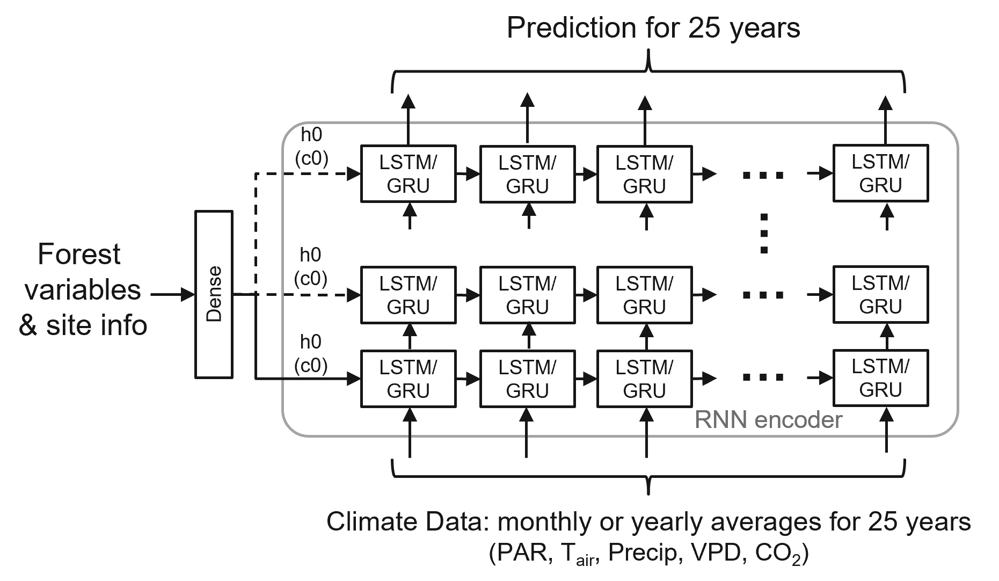
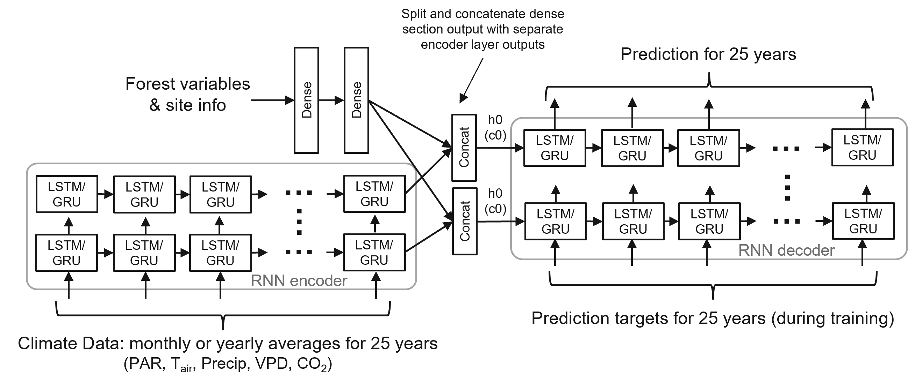
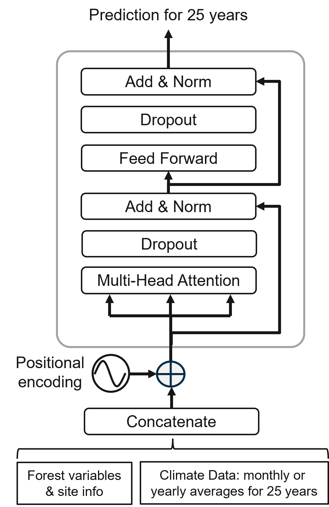

# forest_growth_model_emulator
A Python tool to produce deep learning models for emulating the PREBASSO forest growth and productivity model predictions.

The tool facilitates the training of three different neural network architectures to emulate the prediction task of the Rprebasso (Mäkelä, 1997; Minunno et al., 2016) forest growth model: 
1) Recurrent Neural Network (RNN) encoder network with fully connected input section
2) RNN Encoder-decoder network with fully connected input section
3) Vanilla transformer encoder network.

The tool may be used to produce up to 25-year predictions for forest variables: tree height (H), stem diameter (D), basal area (BA), stem volume (V), and the carbon balance variables: net primary production (npp), gross primary production per tree layer (GPPtrees), net ecosystem exchange (NEP) and gross growth (GGR) to train the machine learning models. The predictions are available for species-wise variables (three species): pine, spruce (spr), and broadleaved (bl) species (e.g. H_pine, H_spr, H_bl; i.e. no variables for totals). 

The data set for the model training and evaluation contains forest variable data from 29,619 field inventory plots in continental Finland that were used as the initial state of the sites to be simulated. These data were provided by The Finnish Forest Centre (FFC). Two additional separate data sets contain aggregated (yearly and monthly) climate data downloaded from Copernicus Climate Data Store (CDS) to provide realistic climate scenarios.

Data origins:

FFC data: 
https://www.metsakeskus.fi/fi/avoin-metsa-ja-luontotieto/metsatietoaineistot/metsavaratiedot

CDS climate data: 
https://cds.climate.copernicus.eu/#!/home

***
### Network Architectures

Three different network architectures have been defined for the forest variable growth or carbon balance variable prediction task.

#### i) The RNN encoder with fully connected input section (FC_RNN)

<b>The FC_RNN_Model architecture contains the modules:</b>

1. The dense (fully connected) network for the static inputs = site info & forest variables (i.e. the starting year status)
2. An RNN network the takes the yearly or monthly weather data time series as input (for 25 years)

The fully connected block's outputs are connected to the RNN hidden state (and cell state with LSTM) initial inputs (h0, c0), and replicated for selectable number of bottom layers if the nuber of the RNN layers > 1.
    

 

GRU = Gated Recurrent Unit, LSTM = Long short-term memory, PAR = photosynthetically active radiation, TAir = daily temperature, Precip = precipitation, VPD = vapour pressure deficit, CO2 = carbon dioxide, h0 = hidden state vector, c0 = cell state vector

***
#### iI) The seq2seq model (S2S)

<b>The seq2seq model architecture contains the modules:</b>

1. The dense (fully connected) network for the static inputs = site info & forest variables (i.e. the starting year status)
2. An encoder network the takes the yearly or monthly weather data time series as input (for 25 years)
3. A concatenation part that concatenates the hidden output of the encoder and the outputs of the linear network
4. A decoder that takes the concatenated context vector from the encoder part, and the 25-year prediction targets (in training phase), and produces the predictions for nYears = 25

The encoder block outputs are concatenated with the outputs from the fully connected block, and connected to
the RNN hidden state inputs (h0). If the nuber of the encoder layers > 1, the fully connected block's outputs are split and divided between the decoder separate layers h0 inputs. With LSTM type RNN the h0 inputs are replicated for cell state inputs c0. 

 

GRU = Gated Recurrent Unit, LSTM = Long short-term memory, PAR = photosynthetically active radiation, TAir = daily temperature, Precip = precipitation, VPD = vapour pressure deficit, CO2 = carbon dioxide, h0 = hidden state vector, c0 = cell state vector

***
#### iii) Vanilla transformer encoder model (TXFORMER)

<b>Transformer encoder</b>

This net architecture is arealization of the vanilla transformer (Vaswani et al. 2017) encoder. The static inputs (= site info & forest variables) are concatenated with the sequential climate data inputs. The architecture includes the Positional encoding, the Multi-head attention and the Feed-Forward blocks of the transformer.
    

***
The initial code for the above architectures has been adopted from the following sources:

Seq2seq Model & FC_RNN encoder model: 
https://github.com/bentrevett/pytorch-seq2seq/blob/master/1%20-%20Sequence%20to%20Sequence%20Learning%20with%20Neural%20Networks.ipynb 

https://github.com/SheezaShabbir/Time-series-Analysis-using-LSTM-RNN-and-GRU/blob/main/Pytorch_LSTMs%2CRNN%2CGRU_for_time_series_data.ipynb 

The Transformer encoder model: 
https://pytorch-tutorials-preview.netlify.app/beginner/transformer_tutorial.html 

***
### For the PREBASSO tool, see:
https://github.com/ForModLabUHel/Rprebasso

***
### References: 
Mäkelä, A. (1997). A Carbon Balance Model of Growth and Self-Pruning in Trees Based on Structural Relationships. Forest Science, 43(1), 7–24. https://doi.org/10.1093/forestscience/43.1.7
  
Minunno, F., Peltoniemi, M., Launiainen, S., Aurela, M., Lindroth, A., Lohila, A., Mammarella, I., Minkkinen, K., & Mäkelä, A. (2016). Calibration and validation of a semi-empirical flux ecosystem model for coniferous forests in the Boreal region. Ecological Modelling, 341, 37–52. https://doi.org/10.1016/j.ecolmodel.2016.09.020
  
Vaswani, A. et al. (2017) ‘Attention is all you need’, in Proceedings of the 31st International Conference on Neural Information Processing Systems. Red Hook, NY, USA: Curran Associates Inc. (NIPS’17), pp. 6000–6010.

***
## NOTE: This repository is not ready!

